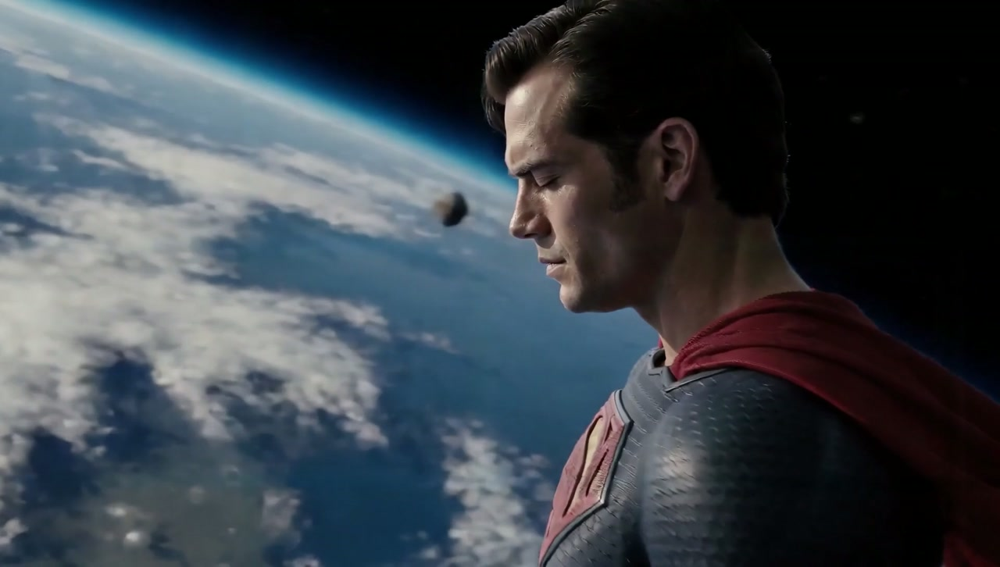
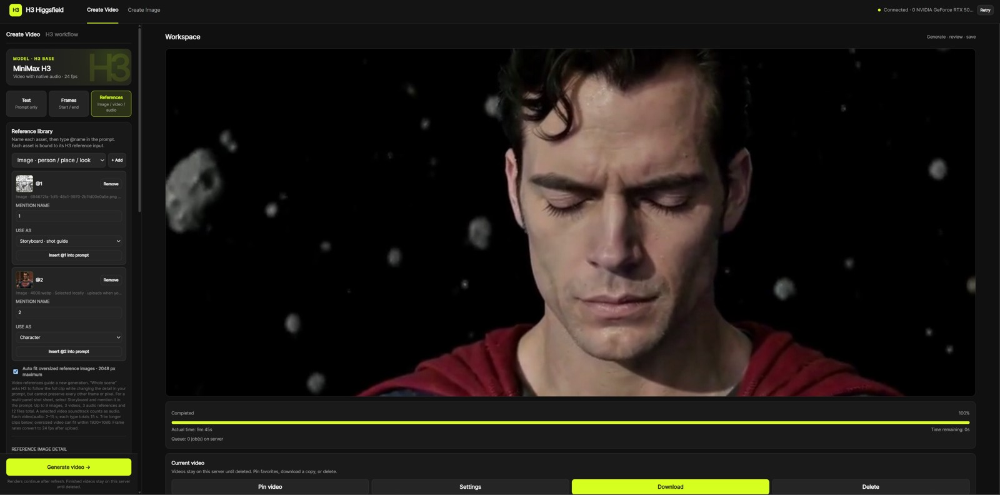
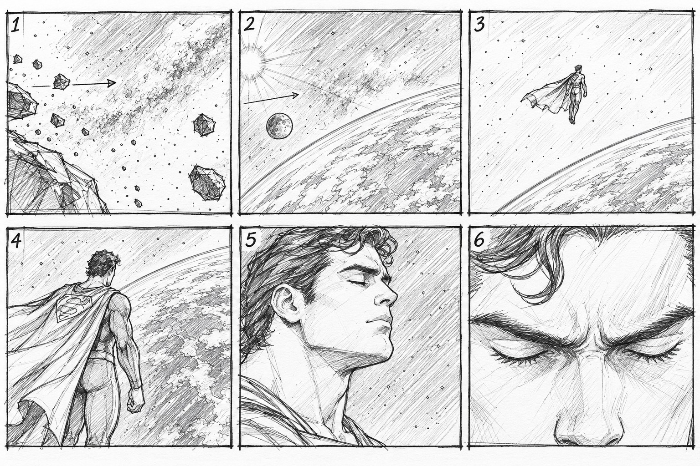

# H3 Higgsfield

### Direct the shot. Keep the whole workflow in view.

**MiniMax H3 video with native audio. Qwen image creation and editing. One browser workspace on your own machine or GPU server.**

[Get started](docs/INSTALL.md) · [Try the Superman example](docs/demo/superman/README.md) · [Features](#built-around-the-way-you-create) · [Community](https://github.com/underworldhistory1-ctrl/minimax-h3-higgsfield/discussions)

**Storyboard direction + character appearance → a cinematic shot.** [Watch with audio](docs/demo/superman/superman-excerpt.mp4), then [open the references, setup and full prompt](docs/demo/superman/README.md).

## Your scene, with every reference given a job

Start with an idea, an opening frame, or a set of references. Tell Studio what each asset should contribute: the character, the location, the visual style, the camera movement, or the storyboard. Name it, mention it in the prompt, and inspect the result before rendering.

The workspace brings generation, reference handling, progress, projects and finished takes together. ComfyUI powers the work behind the page; the everyday creation flow stays in the studio.

*Production capture from the Superman example. The current V2 release adds the updated project workspace, shared queue and prompt preparation controls.*

## Built around the way you create

| What you want to do | What Studio gives you |
| --- | --- |
| **Direct from references** | Named images, videos and audio, clear reference roles, blue mentions and a preview of the connected tags. |
| **Bring a storyboard to life** | A dedicated **Storyboard · shot guide** role, paired with separate character references and your shot instructions. |
| **Write naturally** | Automatic formatting, Arabic/English headings, Markdown, JSON with comments and multiline YAML. Your original brief stays editable. |
| **Prepare a complex brief with AI** | Optional reference-aware preparation with a configured model, sampled video frames, validation and a preview. |
| **Shape motion or structure** | Optional Fun-ControlNet 2.0: extract body-motion, depth, outline or lighting guidance from an ordinary video when its models are installed. |
| **Refine a take** | Optional latent Refine and installed LoRAs, with availability checked before submission. |
| **Keep work across sessions** | Saved projects, portable export, continuation, temporal guides and finished takes with their settings. |
| **Share a GPU server** | A queue that separates your work from other projects and keeps cancellation scoped to your job. |
| **Create supporting images** | A separate Qwen Image 2.1 workspace for creation and reference-based editing. |

Start with **Original quality**. Try the available render methods and LoRAs when you want a different tradeoff; Studio shows what is installed on your server.

## Try it: Superman above Earth

| `@1` — Storyboard | `@2` — Character |
| --- | --- |
|  |  |
| Choose **Storyboard · shot guide** for the camera journey and reveal order. | Choose **Character** for the face, hair, physique and suit. |

1. Choose **Create Video → References**.
2. Upload the storyboard, name it **1**, and select **Storyboard · shot guide**.
3. Upload the character image, name it **2**, and select **Character**.
4. Paste the [creator’s prompt](docs/demo/superman/prompt.txt), inspect the preview, choose your output settings and generate.

The example includes the supplied reference images, production screenshot, prompt and a **4.21-second video excerpt**. [Open the complete walkthrough →](docs/demo/superman/README.md)

## A different fit for your workflow

H3 Higgsfield focuses on a dedicated browser workspace: reference roles, project continuity, a shared-server queue, selectable rendering options, and a combined video/image creation flow.

| If your priority is… | A useful starting point |
| --- | --- |
| **Creating and reviewing shots in a dedicated studio page** | **H3 Higgsfield**, with ComfyUI running behind the workspace. |
| **Building or changing the graph yourself** | [ComfyUI’s native H3 workflows](https://github.com/Comfy-Org/docs/blob/main/tutorials/video/minimax/minimax-h3-native.mdx). |
| **Adding multimodal prompt writing to an existing ComfyUI workflow** | [MiniMax H3 Prompt Writer](https://github.com/duckyshell/ComfyUI-MiniMaxH3-Prompt-Writer). |
| **Working inside a ComfyUI sidebar with a built-in clip editor** | [ComfyUI MiniMaxH3 Studio](https://github.com/rookiestar28/ComfyUI-MiniMaxH3-Studio). |

These are workflow choices, not a render-quality ranking. H3 Higgsfield is an independent project built on MiniMax H3 and ComfyUI, with no affiliation to Higgsfield or MiniMax. Its optional prompt preparation is separate from MiniMax’s hosted H3-Context-IR.

## Get started

**Windows or NVIDIA Linux:** follow the [installation guide](docs/INSTALL.md). It covers existing ComfyUI installations, first-time setup and verified model reuse. Once installed, open the studio page at your ComfyUI server address.

| Where you work | Guide |
| --- | --- |
| Windows or Linux | [Install the studio](docs/INSTALL.md) |
| Existing OpenBayes workspace | [Setup and recovery](docs/OPENBAYES.md) |
| SaladCloud | [Container deployment](deploy/SALAD_DEPLOYMENT.md) |
| Upgrading an existing V2 project | [Upgrade and rollback](docs/V2_UPGRADE_AR.md) |

The code is open source. You provide the GPU environment and download the model weights; cloud GPU and optional AI-provider costs depend on your setup.

## More renders to explore

Two comedy-club renders with the same scene and dialogue, using different acceleration methods. Each published demo is 15 seconds, 1280×704, 24 fps and 20 steps, with native audio and no LoRAs.

| Spectrum | MotionCache |
| --- | --- |
|  |  |
| [Watch with audio](docs/demo/spectrum-no-lora.mp4) | [Watch with audio](docs/demo/motioncache-no-lora.mp4) |

## A few things worth knowing

- **Automatic preparation is honest about what runs.** Without a configured AI provider, it formats your prompt locally. With one configured, it can prepare the brief with reference evidence. See [supported prompt formats](docs/PROMPT_INPUT.md).
- **Optional controls need their models.** Refine, ControlNet, motion/depth extractors and LoRAs appear according to readiness. Their presence is not a guarantee of a better take.
- **References guide a new generation.** Storyboards and source videos influence the result; they do not lock every pixel, camera move or cut.
- **Hardware matters.** Models require substantial disk space, and longer high-resolution clips need enough system RAM as well as VRAM. [Installation requirements](docs/INSTALL.md) and [verified behavior](docs/VERIFIED_BEHAVIOR.md) keep the details together.
- **Check model licenses for your use.** Qwen Image 2.1 uses the Qwen Research License. Repository code, demo media, model weights and third-party components have separate licenses.

## Make something, then share it

Post a shot, a reference experiment or a setup question in [Discussions](https://github.com/underworldhistory1-ctrl/minimax-h3-higgsfield/discussions). For a reproducible problem, open an [Issue](https://github.com/underworldhistory1-ctrl/minimax-h3-higgsfield/issues).

[Connected Studio guide](docs/CONNECTED_STUDIO.md) · [Verified behavior](docs/VERIFIED_BEHAVIOR.md) · [Prompt formats](docs/PROMPT_INPUT.md) · [Graph map](docs/GRAPH_MAP.md)

Built on [MiniMax H3](https://huggingface.co/MiniMaxAI/MiniMax-H3) and [ComfyUI](https://github.com/Comfy-Org/ComfyUI). Code: [MIT](LICENSE).
